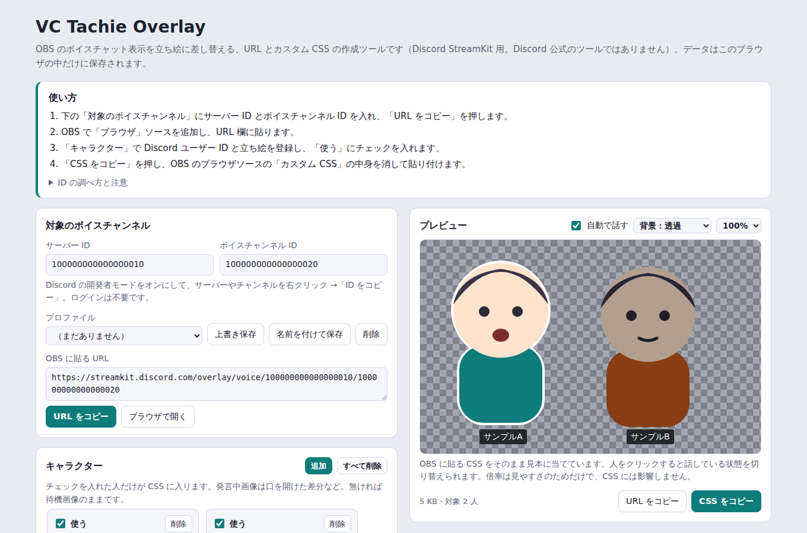

# VC Tachie Overlay

OBS に映すボイスチャットの参加者表示を、アイコンから立ち絵に差し替えるためのツールです。
Discord StreamKit のボイスウィジェット用の URL と、OBS の「カスタム CSS」をブラウザ上で作れます。インストールやログインは不要です。

> Discord 公式のツールではなく、Discord Inc. とは関係ありません。

**ツールを開く：** https://ibaran1um.github.io/vc-tachie-Generator/



## 使い方

1. ツールを開き、サーバー ID とボイスチャンネル ID を入れて「URL をコピー」
2. OBS で「ブラウザ」ソースを追加し、URL 欄に貼り付け
3. ツールの「キャラクター」で Discord ユーザー ID と立ち絵を登録し、「使う」にチェック
4. 「CSS をコピー」を押し、OBS のブラウザソースの「カスタム CSS」の中身を消して貼り付け

### ID の調べ方

Discord の「ユーザー設定 → 詳細設定 → 開発者モード」をオンにします。
サーバー・チャンネル・ユーザーを右クリックすると「ID をコピー」が表示されます。

## 特徴

- **ブラウザだけで完結**：入力したデータはそのブラウザの中（IndexedDB）にだけ保存され、外部には送信しません
- **ライブプレビュー**：StreamKit と同じ構造の見本に、生成した CSS をそのまま当てて確認できます
- **口パク差分に対応**：キャラクターごとに「待機画像」と「発言中画像」を設定できます

## できること

- サーバー ID とボイスチャンネル ID から StreamKit の URL を作成し、プロファイルとして保存・切り替え
- ユーザー ID ごとに、アイコンを立ち絵画像に差し替え（画像はファイルから埋め込み、または画像 URL で指定）
- 話している人の演出：縁取り（虹色に流すことも可）、点滅（色・広がり）、上下運動、追加の動き（ゆらゆら・どきどき・ぶるぶる・ぽよぽよ・うなずき）、話している間の拡大
- 話している人のまわりの演出：マーク（吹き出し・音符・きらきら・ハート・好きな文字など）、後ろの演出（スポットライト・後光・波紋）
- 話していない人の演出：明るさ、不透明度、大きさ、モノクロ、呼吸の動き、話している人だけ表示
- 足元の影、キャラクター同士を重ねる並び（話している人が手前に来る）
- 話している人の名前を目立たせる
- 参加したときの登場アニメーション（ふわっと・下から・ぽんっと）
- 名前の見た目：表示位置（下・上・重ねる）、フォント、文字の大きさと色、太字、文字の縁取り、背景の色・濃さ・角の丸み
- 並び（横・縦・自由配置）、間隔、余白、立ち絵の最大サイズ
- 自由配置：プレビューで立ち絵をドラッグして、人ごとに好きな位置へ置ける（大きさ・重なり順も人ごとに設定可）
- プレビューの背景を透過・黒・白・緑・任意の色に切り替えて、配信画面と同じ条件で確認
- 互換モード：以前の版と同じシンプルな CSS を出力

## 注意

- 自由配置を使うときは、OBS のブラウザソースの幅・高さを、ツールの「配信画面の幅・高さ」と同じにしてください

- Discord のアイコンを設定していないユーザーは、画像の URL に ID が含まれないため、立ち絵に差し替えられません
- 改良版の「登録していない人を隠す」「話している人だけ表示」「自由配置」は CSS の `:has()` を使っています。古い OBS では効かない場合があるので、その場合は互換モードを使ってください
- 名前のフォントは Google Fonts から読み込むため、OBS がインターネットに接続されている必要があります
- Discord 側の更新で StreamKit の構造が変わると、CSS が効かなくなることがあります
- 画像を埋め込むと CSS が大きくなります。重い場合は画像 URL での指定がおすすめです
- 他の人のイラストを使うときは、本人の了承を取ってください

## 自分で動かす

ビルドは不要です。リポジトリをダウンロードして `index.html` をブラウザで開けば動きます。

```
git clone https://github.com/ibaran1um/vc-tachie-overlay.git
```

## ファイル構成

| ファイル | 内容 |
| --- | --- |
| `index.html` | 画面 |
| `app.js` | 画面の動作、保存、プレビュー |
| `css.js` | URL と CSS の生成 |
| `docs/` | README 用の画像 |

## ライセンス

[MIT License](LICENSE)

Discord および StreamKit は Discord Inc. の商標です。
